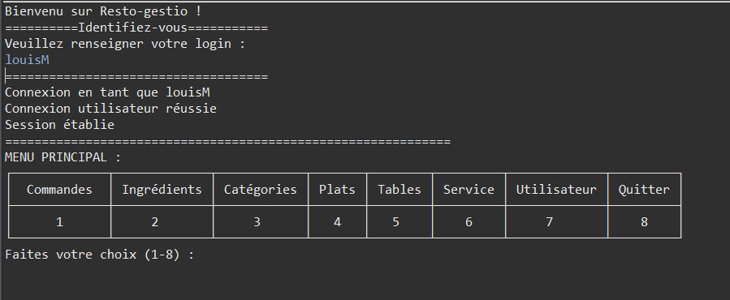
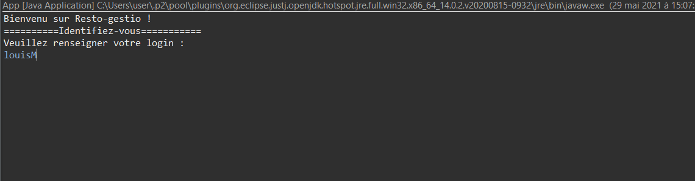

# RestoGestio
Auteur: Stéphane Mairesse, Clément Mercier, Manel Nasri
## Table des contenus
1. [Informations-Generales](#informations-generales)
2. [Technologies](#technologies)
3. [Usage](#usage)

## Informations-Generales
***
RestoGestio est un projet dans le cadre du cours de Génie Logiciel de M1 Miage. Le principe est de permettre aux employés
d'un restaurant de gérés les ingrédients, plats, tables, commandes, cartes, statistiques, ... à travers une même application et selon leurs droits utilisateurs.

## Technologies
***
Les technologies utilisées dans ce projet sont:

* [JAVA](https://openjdk.java.net/) - Programming langage and runtime environnement JAVA 11
* [MAVEN](https://maven.apache.org/) - A software project management and comprehension tool.

## Usage
***
Ouvrir le projet dans un IDE en tant que projet maven (Eclipse de préférence).

Créer sous serveur local wampserver ou xampserver une base de donnée MariaDB nommée "restogestio" avec un interclassement "utf8_general_ci"

Dans cette BDD, importer le fichier sql de la base de donnée initiale contenant le code de création des tables et données de base de cette dernière. (cf `/GenieLogiciel/assets/bdd/restogestio.sql`)

Mettre votre configuration d'accès à la base de donnée pour le projet dans le fichier `/GenieLogiciel/src/main/java/fr/ul/miage/GenieLogiciel/config/config.conf`. (ci besoin voir l'exemple dans `/GenieLogiciel/src/main/java/fr/ul/miage/GenieLogiciel/config/config_exemple.conf`)

Ce placer sur le fichier `/GenieLogiciel/src/main/java/fr/ul/miage/GenieLogiciel/App.java` et le lancer en tant qu'application java (Attention que le JRE System Library soit JavaSE-11 minimum et que votre base de donnée sous wampserver ou xampserver tourne).
Vous devriez alors obtenir

Pour accèder au menu principale de l'application, il vous est préalablement demandé de vous connecter. Pour cela, il faut rentrer un login utilisateur valide de la base de donnée (louisM par exemple)

Ensuite, en fonction des droits de l'utilisateur connecté, il aura accès à plus ou moins de modules et fonctionnalités de l'application.

 
